<picture>
  <source media="(prefers-color-scheme: dark)" srcset="./dark.svg">
  <source media="(prefers-color-scheme: light)" srcset="./light.svg">
  
</picture>

  <!-- TODO: trocar pela URL definitiva do portfolio -->
  <a href="https://github.com/JoaoFariasFranco" title="GitHub"><picture><source media="(prefers-color-scheme: dark)" srcset="./icons/github-dark.svg"></picture></a><a href="https://www.linkedin.com/in/jo%C3%A3o-pedro-farias-franco-75bb70210" title="LinkedIn"><picture><source media="(prefers-color-scheme: dark)" srcset="./icons/linkedin-dark.svg"></picture></a><a href="https://joaofariasfranco.github.io" title="Portfólio"><picture><source media="(prefers-color-scheme: dark)" srcset="./icons/portfolio-dark.svg"></picture></a><a href="mailto:joao.franco.biz@gmail.com" title="E-mail"><picture><source media="(prefers-color-scheme: dark)" srcset="./icons/email-dark.svg"></picture></a>

<picture>
  <source media="(prefers-color-scheme: dark)" srcset="./contrib-heatmap.svg">
  <source media="(prefers-color-scheme: light)" srcset="./contrib-heatmap-light.svg">
  
</picture>
